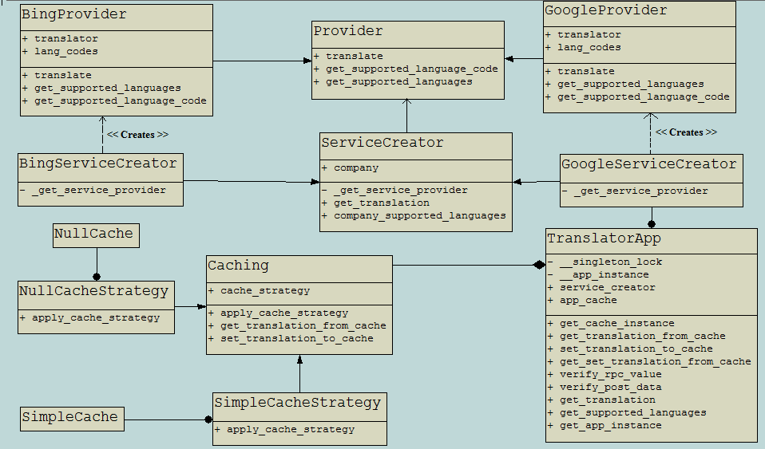

# Language Translation
 This application offers a RESTful API to translate a text from any language to any language. For the actual translation, it is using 
"*googletrans*" which uses Google Translator to get the target translation. The ​text, source, and target language are delivered to
the application via its RESTful API. In addition, this application also employs cache translations. So that if the same text with the same set of source and the target language is requested, then the application does not make the request to the external service but instead
pickup the result from its cache itself; thus avoid making heavy requests to the external translation service. The application keeps
the cache persistent throughout the execution.

## How to install the application software requirements
<code>$ cd lang_translation</code><br>
<code>$ sudo -H pip3 install -r requirements.txt</code> 

This application has been developed and tested on Ubuntu 16.04 LTS OS using Python 3.5.2. For other OS platforms, 
few instructions might need to be adapted.


## How to run the application
<code>$ cd lang_translation</code><br>
<code>$ export PYTHONPATH=$PWD</code><br>
<code>$ python3 run_lang_translation_server.py</code>

## REST API Endpoints

#### How to get the list of languages supported by the application
URI: http://127.0.0.1:5000/translate<br>
Method: GET<br>
Content-Type: application/json<br>
Response:
```text
{
    "Supported languages": "frisian, afrikaans, chinese (traditional), bengali, japanese, latvian, spanish, french, 
    norwegian, hebrew, pashto, icelandic, sundanese, croatian, czech, portuguese, tamil, nepali, samoan, 
    latin, irish, kazakh, malagasy, gujarati, amharic, hungarian, romanian, tajik, korean, malayalam, chinese (simplified), 
    telugu, bulgarian, catalan, zulu, ukrainian, hindi, bosnian, haitian creole, malay, slovenian, xhosa, georgian, 
    luxembourgish, swahili, lao, danish, english, corsican, khmer, swedish, macedonian, basque, hausa, cebuano, somali,
     maori, sesotho, slovak, arabic, myanmar (burmese), kyrgyz, finnish, belarusian, vietnamese, shona, lithuanian, marathi, 
     polish, kannada, chichewa, scots gaelic, yiddish, igbo, armenian, maltese, turkish, hmong, urdu, greek, dutch, sinhala, 
     sindhi, galician, estonian, italian, german, serbian, persian, albanian, azerbaijani, welsh, yoruba, russian, hawaiian,
     esperanto, punjabi, indonesian, mongolian, kurdish (kurmanji), javanese, thai, filipino, uzbek"
}
```

#### How to make a translation request to the application
URI: http://127.0.0.1:5000/translate<br>
Method: POST<br>
Content-Type: application/json<br>
Body:
```text
{
    "text": "What a wonderful world!",
    "source_lang": "English",
    "target_lang": "Hindi"
}
```
Response:
```text
{
    "Translation": "क्या अद्भुत दुनिया है!"
}
```

**Note**: Values for source_lang and target_lang are case-insensitive. All the value of the keys must be a string type.

#### Error Codes
400, 404, 405, 413, 422

# How to execute unit tests for the application
<code>$ cd lang_translation</code><br>
<code>$ python3 -m unittest discover</code>

## Algorithm of Domain Crawler - Domain Mapping
<p align="center">
  
  <br>Class Diagram of Language Translation<br>
</p>

The whole application is encapsulated inside a Singleton design pattern to absolutely make sure that only one instance of the application is executing at any time instant and thus provides a global point of access to that instance. The singleton application instance gets initialized just-in-time instead of "initialization on first use". 


Language Translation Application is conceptually divided into two independent components: Caching and Translation. The purpose of such
decoupling between these two components is to allow them grow completely independent of each other. 


Caching component is designed using Strategy design pattern which allows us to effortlessly add different caching strategies. If at any point in time, the developer decides to switch or add a new caching strategy, then he needs to make very few changes (e.g; TranslatorApp class and
new caching strategy class). Thus, our decision to use Strategy pattern allows caching strategies vary independently from the client 
(TranslatorApp) that uses it. 

Translation component is build using Factory design pattern, which defines an interface (ServiceCreator) for creating an object, but let subclasses (GoogleServiceCreator, BingServiceCreator)
decide which Provider Class (BingProvider, GoogleProvider) to instantiate. This design allows us to defer instantiation to Provider subclasses
and offers less complicated, more customizable, subclasses proliferate. If the developer decides to add more Provider subclasses, he only
needs to add a subclass for ServiceCreator and Provider class and make a single line change into TranslatorApp class.

We have specifically designed our server in this way to exploit the principle of DNR (Do Not Repeat). Our architecture design allows to
grow this into a bigger project and remains easy to maintain. E.g. if we want to change our caching strategy or switch out our
translation​ ​service, the developer needs to make changes only at few defined places.

At the current state of the application, GoogleProvider and SimpleCacheStrategy classes have been enabled into the application, which is also
demonstrated in the above class diagram.


## Future Possible Extension
1. Implement a smart pre-caching. This means we assume if a user translates a text into Hindi, he is likely to also translate
the same text to Urdu. Therefore, it might be beneficial to also request for other languages such as Bengali, Telugu, Tamil, Chinese 
(Languages regional to target language) and store them into application cache. However, this pre-caching should not affect the response time of application for the active user, that's why the pre-caching should happen ​asynchronously.

2. Currently proxy support is not implemented.

3. Currently this application uses [**googletrans**](https://pypi.python.org/pypi/googletrans), which imposes following limitation:
    * The maximum character limit on a single text is 15k.
    * Due to limitations of the web version of google translate, this API does not guarantee that the library would work properly at all times.
    So to achieve a stable API, it is highly recommended to integrate [Google’s official translate API](https://cloud.google.com/translate/docs).
    * If you get HTTP 5xx error or errors like #6, it’s probably because Google has banned your client IP address.
